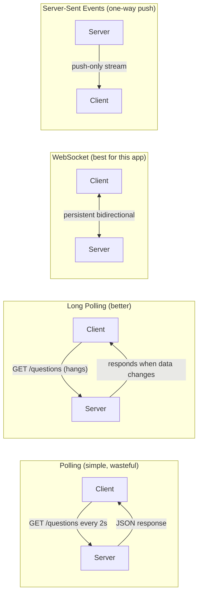
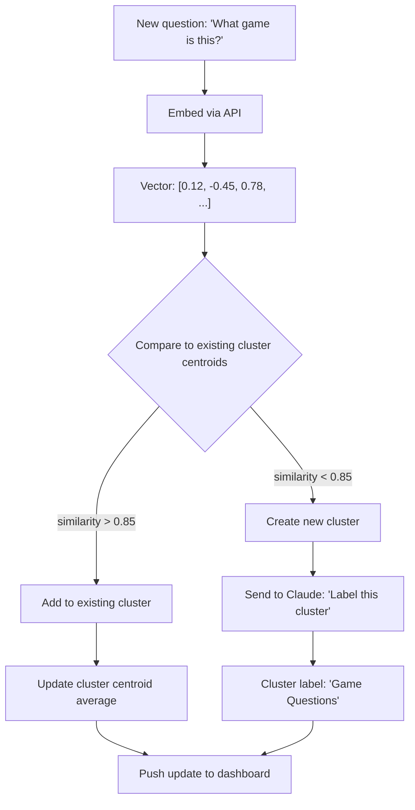
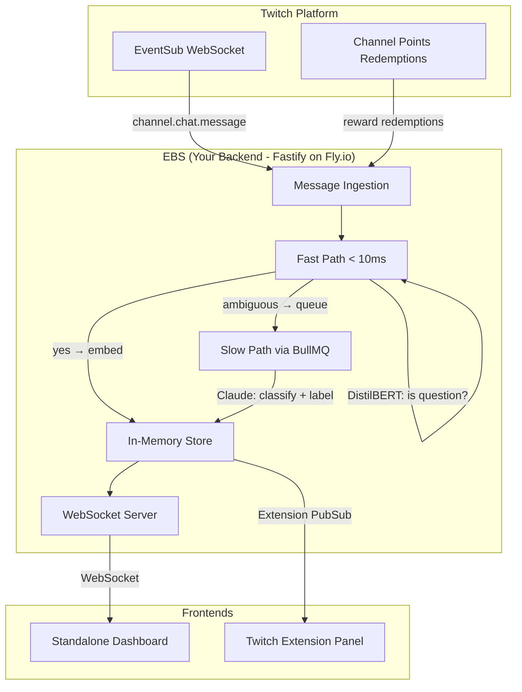

# Learning Guide: Frontend Dev → AI Product Engineer

A hands-on learning path using the Chat Question Tracker as your lab.
Each section connects language-agnostic concepts to what you're actually building.

---

## Table of Contents

1. [Your Current Stack (Next.js + React)](#1-your-current-stack)
2. [Backend Fundamentals](#2-backend-fundamentals)
3. [Real-Time Systems](#3-real-time-systems)
4. [AI/ML Core Concepts](#4-aiml-core-concepts)
5. [Text Classification](#5-text-classification)
6. [Embeddings & Semantic Similarity](#6-embeddings--semantic-similarity)
7. [Clustering](#7-clustering)
8. [Prompt Engineering](#8-prompt-engineering)
9. [Vector Databases](#9-vector-databases)
10. [RAG (Retrieval-Augmented Generation)](#10-rag)
11. [MLOps for Product Engineers](#11-mlops-for-product-engineers)
12. [Putting It All Together](#12-putting-it-all-together)

---

## 1. Your Current Stack

You're using Next.js, but this isn't your usual frontend stack. Here's what matters.

### App Router Mental Model

Next.js App Router flips the default: **everything is a Server Component unless you say otherwise.**

```
┌─────────────────────────────────────────────┐
│              Server Components              │
│         (default — no JS to client)         │
│                                             │
│  ┌─────────────────────────────────────┐    │
│  │        Client Components            │    │
│  │       ("use client" directive)      │    │
│  │                                     │    │
│  │  - Event handlers (onClick, etc.)   │    │
│  │  - State (useState, Zustand)        │    │
│  │  - Effects (useEffect)             │    │
│  │  - Browser APIs (WebSocket, etc.)   │    │
│  └─────────────────────────────────────┘    │
│                                             │
│  Server Components can:                     │
│  - Be async (fetch data directly)           │
│  - Access databases, file system            │
│  - Import Server-only code                  │
│  - Pass data to Client Components as props  │
└─────────────────────────────────────────────┘
```

**Rule of thumb**: Start server, push `"use client"` as far down the tree as possible.

### In Your App

| Component | Server or Client? | Why |
|--|--|--|
| Layout, page shell | Server | Static structure, no interactivity |
| `ConnectionPanel` | Client | WebSocket connection, event handlers |
| `QuestionQueue` | Client | Real-time updates from Zustand store |
| `QuestionCard` | Client | Click handlers (answer, dismiss) |

### Server Actions (Phase 2)

Server Actions replace API routes for mutations. Instead of `fetch('/api/mark-answered')`, you write:

```ts
// actions.ts
"use server"

export async function markAnswered(questionId: string) {
  // runs on the server — can access DB directly
  await db.questions.update(questionId, { status: "answered" })
  revalidatePath("/dashboard")
}
```

```tsx
// QuestionCard.tsx (client component)
import { markAnswered } from "./actions"

<button onClick={() => markAnswered(question.id)}>
  Mark Answered
</button>
```

Next.js handles the network request for you. No API route, no fetch, no endpoint.

### Static Export vs Server-Rendered

Your app currently uses `output: "export"` — pure static files, no Node.js server.

```
Phase 1: Static Export (current)
  ├── Deploy anywhere (Netlify, S3, GitHub Pages)
  ├── No server = no cost
  ├── No Server Components, no Server Actions
  └── All logic runs in the browser

Phase 2: Server-Rendered (future)
  ├── Needs a Node.js server (Railway, Fly.io)
  ├── Server Components for initial data
  ├── Server Actions for mutations
  └── Client Components for real-time WebSocket UI
```

You'll drop `output: "export"` when you add the backend. The dashboard page becomes server-rendered (auth check, initial question load), with client components for the live feed.

---

## 2. Backend Fundamentals

Language-agnostic concepts you'll need. Examples in Node.js/TypeScript since that's your project, but these patterns exist in every language.

### The Server is Just a Loop

Every backend server, regardless of language, does this:

```
┌──────────────┐
│  Listen on   │
│  a port      │
│  (e.g. 3001) │
└──────┬───────┘
       │
       ▼
┌──────────────┐     ┌──────────────┐
│  Receive     │────▶│  Route to    │
│  request     │     │  handler     │
└──────────────┘     └──────┬───────┘
                            │
                            ▼
                     ┌──────────────┐
                     │  Process     │
                     │  (DB, AI,    │
                     │   compute)   │
                     └──────┬───────┘
                            │
                            ▼
                     ┌──────────────┐
                     │  Send        │
                     │  response    │
                     └──────────────┘
```

### Request-Response vs Event-Driven

Two paradigms you'll use in this app:

**Request-Response** (REST API):
```
Client ──GET /questions──▶ Server ──JSON──▶ Client
```
Used for: fetching the current question list, updating settings, marking questions.

**Event-Driven** (WebSocket / PubSub):
```
Server ──push──▶ Client  (new question detected)
Server ──push──▶ Client  (cluster updated)
Server ──push──▶ Client  (summary refreshed)
```
Used for: real-time question feed, live updates to the dashboard.

**Your app uses both**: REST for CRUD operations, WebSocket/PubSub for live data.

### Framework Choices (Node.js)

| Framework | Speed | TypeScript | Why you'd pick it |
|--|--|--|--|
| **Express** | ~15K req/s | Via @types | Massive ecosystem, everyone knows it |
| **Fastify** | ~30K req/s | Built-in | Schema validation, plugins, 2x Express speed |
| **Hono** | ~40K+ req/s | First-class | Ultralight, runs everywhere (Node, Deno, Bun, edge) |

**For this app**: Fastify is the sweet spot — fast, great TypeScript support, built-in JSON Schema validation (useful for AI response parsing), and native WebSocket support.

### Middleware Pattern

Middleware = functions that run before your handler. Every backend framework has this concept.

```
Request → [Auth] → [Logging] → [Rate Limit] → Handler → Response
```

```
In your app's terms:

Twitch message → [Parse] → [Bot Filter] → [Spam Filter] → [Quality Filter] → [Classifier] → Store
```

Your filter pipeline is already middleware — you just haven't called it that. In Phase 2, these filters move from browser to server but the pattern is identical.

### Stateless vs Stateful

```
┌─────────────────────────────────────────────────┐
│                  STATELESS                       │
│                                                  │
│  Each request is independent.                    │
│  Server stores nothing between requests.         │
│  Scale by adding more servers.                   │
│                                                  │
│  Examples: REST APIs, serverless functions        │
└─────────────────────────────────────────────────┘

┌─────────────────────────────────────────────────┐
│                  STATEFUL                         │
│                                                  │
│  Server remembers things between requests.       │
│  WebSocket connections are stateful.             │
│  Harder to scale (sticky sessions).              │
│                                                  │
│  Examples: WebSocket servers, game servers        │
└─────────────────────────────────────────────────┘
```

**Your EBS is stateful** — it holds WebSocket connections to Twitch EventSub and maintains the in-memory question queue. This is why you run it on a persistent server (Fly.io/Railway), not serverless.

---

## 3. Real-Time Systems

Your app is fundamentally real-time. Understanding these patterns is critical.

### Communication Patterns



**For your dashboard**: WebSocket is the right choice — you need bidirectional communication (server pushes questions, client sends mark-answered/dismiss actions).

**For the Twitch Extension**: Extension PubSub is one-way (EBS → extension frontend). The extension sends actions back via HTTP to the EBS.

### Event-Driven Architecture

The core pattern for your backend:

```
┌─────────────────────────────────────────────────────────────────┐
│                     EVENT-DRIVEN BACKEND                        │
│                                                                 │
│  ┌──────────┐    ┌──────────┐    ┌──────────┐    ┌──────────┐  │
│  │  Twitch   │    │  Event   │    │ Handlers │    │  Output  │  │
│  │ EventSub  │───▶│  Bus     │───▶│          │───▶│          │  │
│  │ WebSocket │    │          │    │ classify │    │ WebSocket│  │
│  └──────────┘    │          │    │ embed    │    │ to dash  │  │
│                  │          │    │ cluster  │    │          │  │
│  ┌──────────┐    │          │    │ summarize│    │ Ext.     │  │
│  │  Channel  │───▶│          │    │          │    │ PubSub   │  │
│  │  Points   │    │          │    └──────────┘    │          │  │
│  │  Redemp.  │    │          │                    │ REST API │  │
│  └──────────┘    └──────────┘                    └──────────┘  │
│                                                                 │
│  "Events in, events out. Handlers are pure functions."          │
└─────────────────────────────────────────────────────────────────┘
```

**Language-agnostic principle**: Decouple producers (Twitch) from consumers (your AI pipeline) with an event bus. In Node.js this can be as simple as an `EventEmitter`. At scale, it becomes Redis Pub/Sub or a message queue.

### Message Queues

When AI calls are too slow for the real-time path:

```
                  FAST PATH (< 10ms)              SLOW PATH (200-2000ms)
                  ─────────────────               ───────────────────────
New message ──▶ Classify (local model) ──▶ Dashboard
                       │
                       └──▶ Enqueue ──▶ [Redis/BullMQ] ──▶ Worker
                                                              │
                                                         Claude API
                                                         (label clusters,
                                                          summarize)
                                                              │
                                                              ▼
                                                         Dashboard update
```

**BullMQ** (Node.js + Redis) is the standard for this:
- Reliable — jobs survive server restarts
- Rate limiting — respect AI API limits
- Retries — handle transient failures
- Priority — urgent jobs first
- Dashboard — monitor queue health via Bull Board

**The concept**: Anything that doesn't need an instant response goes in the queue. The user sees the question instantly (fast path), then sees the cluster label update a second later (slow path).

---

## 4. AI/ML Core Concepts

Language-agnostic fundamentals. No PhD required.

### The AI Landscape for Product Engineers

```
┌─────────────────────────────────────────────────────────────┐
│                    HOW AI IS USED IN PRODUCTS                │
│                                                              │
│  ┌─────────────────┐  ┌──────────────────┐  ┌────────────┐  │
│  │  CLASSIFICATION  │  │   GENERATION     │  │  SEARCH    │  │
│  │                  │  │                  │  │            │  │
│  │ "Is this a       │  │ "Summarize these │  │ "Find      │  │
│  │  question?"      │  │  20 questions"   │  │  similar   │  │
│  │                  │  │                  │  │  questions" │  │
│  │ Input → Label    │  │ Input → Text     │  │ Input →    │  │
│  │                  │  │                  │  │ Ranked     │  │
│  │ Fast, cheap      │  │ Slow, expensive  │  │ results    │  │
│  │ Can run locally  │  │ Needs LLM API    │  │            │  │
│  └─────────────────┘  └──────────────────┘  │ Needs      │  │
│                                              │ embeddings │  │
│  Your app uses ALL THREE.                    └────────────┘  │
└─────────────────────────────────────────────────────────────┘
```

### Models vs APIs

```
┌──────────────────────────────────────────────────────┐
│                    MODEL SPECTRUM                      │
│                                                       │
│  Small/Local ◄──────────────────────────▶ Large/API  │
│                                                       │
│  DistilBERT          GPT-4o-mini          Claude 4    │
│  66M params          ~8B params           ???B params │
│  ~10ms latency       ~200ms latency       ~500ms     │
│  Free (self-host)    $0.15/1M tokens      $3/1M in   │
│  Classification      Chat, simple gen     Complex    │
│  only                                     reasoning  │
│                                                       │
│  ┌─────────────────────────────────────────────────┐  │
│  │  PRODUCT ENGINEER INSIGHT:                      │  │
│  │                                                 │  │
│  │  You almost never train a model from scratch.   │  │
│  │  You either:                                    │  │
│  │    1. Call an API (Claude, OpenAI)               │  │
│  │    2. Fine-tune a small existing model           │  │
│  │    3. Use embeddings + similarity (no "model"    │  │
│  │       training at all)                           │  │
│  └─────────────────────────────────────────────────┘  │
└──────────────────────────────────────────────────────┘
```

### Tokens

Every AI API charges by tokens. Tokens are word fragments:

```
"What game are you playing?" → ["What", " game", " are", " you", " playing", "?"]
                                 = 6 tokens

Twitch chat messages are SHORT — typically 5-30 tokens each.
At 1,000 questions/stream with classification + embedding:
  ≈ 15,000 tokens/stream ≈ $0.003 with text-embedding-3-small
```

This is why AI for chat is cheap — messages are tiny.

---

## 5. Text Classification

The first AI feature you'll build: replacing `message.includes("?")` with real intelligence.

### The Evolution

```
Phase 1 (current):     message.includes("?")        → boolean
Phase 2 (rule-based):  regex + heuristics            → boolean + confidence
Phase 2 (AI):          LLM or fine-tuned model       → label + confidence

"Is this a question?" sounds simple, but:
  "lol what??"        → rhetorical (NOT a real question)
  "I wonder if..."    → question (no "?" at all)
  "!commands"         → command (has "?" nowhere)
  "Settings?"         → question (single word, but valid)
```

### Three Approaches

#### 1. Zero-Shot LLM (easiest, most expensive)

Send each message to Claude/GPT with a classification prompt. No training data needed.

```
Input:  "What resolution do you stream at?"
Prompt: "Classify this Twitch chat message. Is it a genuine question?"
Output: { "label": "question", "confidence": 0.95 }
```

**Pros**: Works immediately, handles nuance, no training data.
**Cons**: 200-500ms per call, $$$$ at scale, overkill for simple classification.

#### 2. Fine-Tuned Small Model (best for production)

Take a pre-trained model like DistilBERT and teach it YOUR specific task with labeled examples.

```
Training data (you create ~500-1000 of these):
  "What game is this?"           → question
  "!lurk"                        → not_question
  "lol what even is that??"      → rhetorical
  "I wonder if he'll make it"    → question
  "POG POG POG"                  → not_question

Result: A model that runs in <10ms, costs nothing, and is 95%+ accurate.
```

**The fine-tuning process**:

```
┌──────────────┐     ┌──────────────┐     ┌──────────────┐
│ Pre-trained   │     │  Your labeled │     │  Fine-tuned  │
│ DistilBERT    │ ──▶ │  chat data    │ ──▶ │  classifier  │
│ (general      │     │  (500-1000    │     │  (YOUR task) │
│  English)     │     │   examples)   │     │              │
└──────────────┘     └──────────────┘     └──────────────┘
     66M params         ~2 hours              <10ms inference
     Hugging Face       on free Colab GPU     Runs on CPU
```

#### 3. Hybrid (what you should do)

```
┌──────────────────────────────────────────────────┐
│              HYBRID APPROACH                      │
│                                                   │
│  Message ──▶ DistilBERT classifier (< 10ms)      │
│                 │                                  │
│                 ├── confidence > 0.8 → use result  │
│                 │                                  │
│                 └── confidence < 0.8 → send to     │
│                     Claude for second opinion       │
│                     (200ms, but rare — ~10% of      │
│                      messages)                      │
│                                                   │
│  Result: Fast + accurate + cost-effective          │
└──────────────────────────────────────────────────┘
```

### Industry Standard: Tiered Model Routing

This is what production AI systems actually do:

```
100% of messages
    │
    ├── 70% → Cheap/fast model (DistilBERT, rules)     ~$0/month
    ├── 20% → Mid-tier model (GPT-4o-mini, Haiku)      ~$5/month
    └── 10% → Premium model (Claude Opus, GPT-4o)      ~$15/month

Total cost: ~$20/month instead of ~$200/month for premium-only.
```

---

## 6. Embeddings & Semantic Similarity

This is how you'll group similar questions together ("What game is this?" and "Which game are you playing?" are the same question).

### What is an Embedding?

An embedding converts text into a list of numbers (a vector) that captures meaning.

```
"What game is this?"      → [0.12, -0.45, 0.78, 0.33, ... ] (1536 numbers)
"Which game are you playing?" → [0.11, -0.43, 0.79, 0.31, ... ] (1536 numbers)
"Is your chair comfortable?"  → [0.67, 0.12, -0.34, 0.89, ... ] (1536 numbers)

Similar meaning = similar numbers.
Different meaning = different numbers.
```

### Cosine Similarity

Measures how similar two vectors are. Score from 0 (unrelated) to 1 (identical meaning).

```
                    ▲ dimension 2
                    │
                    │    ╱ "What game?"
                    │   ╱   (vector A)
                    │  ╱ ←── small angle = high similarity (0.98)
                    │ ╱
                    │╱───── "Which game are you playing?"
                    │        (vector B)
                    │
                    │
 ───────────────────┼──────────────────────▶ dimension 1
                    │
                    │
                    │  ╲
                    │   ╲←── large angle = low similarity (0.23)
                    │    ╲
                    │     ╲ "Is your chair comfortable?"
                    │       (vector C)

    cosine_similarity(A, B) = 0.98  → Same question!
    cosine_similarity(A, C) = 0.23  → Different topics.
```

### The Math (simplified)

```
cosine_similarity(A, B) = (A · B) / (|A| × |B|)

Where:
  A · B     = sum of (a_i × b_i) for each dimension
  |A|       = sqrt(sum of a_i²)

In code:

function cosineSimilarity(a: number[], b: number[]): number {
  let dot = 0, normA = 0, normB = 0
  for (let i = 0; i < a.length; i++) {
    dot   += a[i] * b[i]
    normA += a[i] * a[i]
    normB += b[i] * b[i]
  }
  return dot / (Math.sqrt(normA) * Math.sqrt(normB))
}
```

**Pro tip**: If you normalize vectors when you store them (make each vector length 1), cosine similarity simplifies to just a dot product — much faster.

### Embedding Models (2025-2026)

| Model | Dimensions | Cost per 1M tokens | Best for |
|--|--|--|--|
| **OpenAI text-embedding-3-small** | 1536 | $0.02 | Best cost/quality ratio |
| **OpenAI text-embedding-3-large** | 3072 | $0.13 | Higher accuracy |
| **Cohere embed-v4** | Variable | $0.10 | Multilingual, top benchmarks |
| **BGE-M3** (open-source) | 1024 | Free (self-host) | No API dependency |

**For this app**: Start with `text-embedding-3-small`. Chat messages are short, volume is low, cost is negligible (~$0.003 per 1,000 questions).

### The Pipeline: Embed → Compare → Cluster → Label



---

## 7. Clustering

Grouping similar questions so the streamer sees "15 people asked about your settings" instead of 15 separate cards.

### Formal Algorithms vs Practical Approach

There are formal clustering algorithms (K-Means, DBSCAN, HDBSCAN), but for a chat app, you don't need them.

```
┌──────────────────────────────────────────────────────────────────────┐
│                    CLUSTERING ALGORITHMS                              │
│                                                                      │
│  K-Means                                                             │
│  ├── You must specify K (number of clusters) upfront                 │
│  ├── Bad for chat — you don't know how many topics will come up      │
│  └── Not suitable for streaming data                                 │
│                                                                      │
│  DBSCAN                                                              │
│  ├── Finds clusters automatically based on density                   │
│  ├── Handles noise (labels outliers)                                 │
│  ├── BUT needs the full dataset — can't process one message at a time│
│  └── Not suitable for streaming data                                 │
│                                                                      │
│  HDBSCAN                                                             │
│  ├── Best quality clusters                                           │
│  ├── Handles varying density                                         │
│  ├── BUT also needs the full dataset                                 │
│  └── Not suitable for streaming data                                 │
│                                                                      │
│  ┌────────────────────────────────────────────────────────────────┐   │
│  │  FOR YOUR APP: THRESHOLD-BASED ONLINE CLUSTERING              │   │
│  │                                                                │   │
│  │  No algorithm library needed. Just cosine similarity           │   │
│  │  with a threshold. Process one message at a time.              │   │
│  │  This is what most real-time chat products actually do.        │   │
│  └────────────────────────────────────────────────────────────────┘   │
└──────────────────────────────────────────────────────────────────────┘
```

### Online Clustering (What You'll Build)

```
                    Cluster Store (in memory)
                    ┌─────────────────────────────────┐
                    │  Cluster 1: "Game Questions"     │
                    │    centroid: [0.12, -0.45, ...]   │
                    │    count: 15                      │
                    │    questions: [...]               │
                    │                                   │
                    │  Cluster 2: "Audio Issues"        │
                    │    centroid: [0.67, 0.12, ...]    │
                    │    count: 8                       │
                    │    questions: [...]               │
                    │                                   │
                    │  Cluster 3: "Schedule"            │
                    │    centroid: [0.34, 0.56, ...]    │
                    │    count: 3                       │
                    │    questions: [...]               │
                    └─────────────┬───────────────────┘
                                  │
    New question arrives          │
    "What are you playing?"       │
    embedded → [0.11, -0.43, ...] │
                                  │
                    Compare against all centroids:
                    ├── Cluster 1: similarity = 0.96 ✓ (> 0.85 threshold)
                    ├── Cluster 2: similarity = 0.23
                    └── Cluster 3: similarity = 0.31

                    → Assign to Cluster 1
                    → Update centroid = average of all vectors in cluster
                    → count: 15 → 16
```

### Pseudocode

```
function assignToCluster(questionVector, clusters, threshold = 0.85):
    bestMatch = null
    bestScore = 0

    for cluster in clusters:
        score = cosineSimilarity(questionVector, cluster.centroid)
        if score > bestScore:
            bestScore = score
            bestMatch = cluster

    if bestScore >= threshold:
        bestMatch.addQuestion(questionVector)
        bestMatch.updateCentroid()  // recalculate average
        return bestMatch
    else:
        newCluster = createCluster(questionVector)
        clusters.add(newCluster)
        return newCluster
```

### How Slack Does It

Slack AI (processing billions of messages) uses a different approach — they don't cluster in real-time. They:
1. Batch-process messages overnight for recaps
2. Weight messages by importance (reactions, decisions, action items)
3. Use tiered AI processing with concurrency slots

For a Twitch stream (hundreds to low thousands of messages), real-time clustering is totally feasible.

---

## 8. Prompt Engineering

The skill that makes or breaks AI product features. This is the most hands-on AI skill for a product engineer.

### Classification Prompt for Your App

```
System prompt:

You are a Twitch chat message classifier. Analyze the message and classify it.

Categories:
- "question": A genuine question the streamer should answer
- "rhetorical": Rhetorical, sarcastic, or not seeking an answer
- "not_question": Not a question

Consider Twitch chat context:
- Emote spam and copypasta are not questions
- Short reactions like "what??" are usually rhetorical
- Questions about the game, setup, or streamer are genuine

Respond with JSON only: { "label": "...", "confidence": 0.0-1.0 }
```

### Few-Shot vs Zero-Shot

```
┌────────────────────────────────────────────────────┐
│  ZERO-SHOT (no examples)                           │
│                                                    │
│  "Classify this message: 'What game is this?'"     │
│                                                    │
│  Works for obvious cases. Struggles with nuance.   │
│  Cheaper (fewer tokens).                           │
└────────────────────────────────────────────────────┘

┌────────────────────────────────────────────────────┐
│  FEW-SHOT (3-5 examples)                           │
│                                                    │
│  "Here are some examples:                          │
│   'What game is this?' → question                  │
│   'lol what??' → rhetorical                        │
│   'POG' → not_question                             │
│   '!commands' → not_question                       │
│   'I wonder what rank he is' → question            │
│                                                    │
│   Now classify: 'Is that a mod?'"                  │
│                                                    │
│  Significantly better for edge cases.              │
│  +50-200 tokens overhead. Worth it.                │
└────────────────────────────────────────────────────┘
```

**Always use few-shot for classification.** The token overhead is tiny for chat messages.

### Structured Output

Modern APIs (Claude, OpenAI) support guaranteed JSON output:

```ts
// Claude structured output
const response = await anthropic.messages.create({
  model: "claude-haiku-4-5-20251001",
  max_tokens: 100,
  messages: [{ role: "user", content: `Classify: "${message}"` }],
  // Guarantees valid JSON matching your schema
  tool_choice: { type: "tool", name: "classify" },
  tools: [{
    name: "classify",
    description: "Classify a chat message",
    input_schema: {
      type: "object",
      properties: {
        label: { type: "string", enum: ["question", "rhetorical", "not_question"] },
        confidence: { type: "number", minimum: 0, maximum: 1 }
      },
      required: ["label", "confidence"]
    }
  }]
})
```

No regex parsing. No "sometimes the model returns markdown." The schema is enforced at the token generation level.

### Prompt Engineering Patterns That Matter

| Pattern | What it is | When to use |
|--|--|--|
| **System prompt** | Persistent instructions | Always — sets the model's role |
| **Few-shot examples** | Input/output pairs | Classification, formatting |
| **Chain of thought** | "Think step by step" | Complex reasoning (not for classification) |
| **Structured output** | JSON schema enforcement | Whenever you parse the response programmatically |
| **Temperature** | Randomness control | 0 for classification, 0.7+ for creative generation |

---

## 9. Vector Databases

### Do You Need One?

```
┌─────────────────────────────────────────────────────────────┐
│                     DECISION TREE                            │
│                                                              │
│  How many vectors do you have?                               │
│     │                                                        │
│     ├── < 10,000 (one stream) ──▶ In-memory array           │
│     │     60MB RAM, <1ms search      No database needed.     │
│     │                                                        │
│     ├── 10K-100K (history) ──▶ Chroma (embedded)            │
│     │     Runs in your Node.js process.                      │
│     │     No separate server. SQLite under the hood.         │
│     │                                                        │
│     ├── 100K-1M (multi-channel) ──▶ pgvector                │
│     │     Add to your existing Postgres.                     │
│     │     SQL + vector search in one DB.                     │
│     │                                                        │
│     └── 1M+ (platform scale) ──▶ Pinecone / Qdrant          │
│           Managed, distributed, auto-scaling.                │
│           $70+/month.                                        │
│                                                              │
│  ┌───────────────────────────────────────────────────────┐   │
│  │  YOUR APP: Start with in-memory. A busy stream might  │   │
│  │  generate 1,000-5,000 questions. That's ~30MB.        │   │
│  │  Add Chroma or pgvector only when you persist across  │   │
│  │  streams or scale to multiple channels.               │   │
│  └───────────────────────────────────────────────────────┘   │
└─────────────────────────────────────────────────────────────┘
```

### In-Memory Vector Store (What You'll Start With)

```ts
interface Cluster {
  id: string
  label: string
  centroid: number[]       // average embedding of all questions
  questions: Question[]
  count: number
}

class VectorStore {
  private clusters: Cluster[] = []

  findSimilar(vector: number[], threshold = 0.85): Cluster | null {
    let best: Cluster | null = null
    let bestScore = 0

    for (const cluster of this.clusters) {
      const score = cosineSimilarity(vector, cluster.centroid)
      if (score > bestScore) {
        bestScore = score
        best = cluster
      }
    }

    return bestScore >= threshold ? best : null
  }
}
```

That's it. No database, no infra. Perfectly adequate for your scale.

---

## 10. RAG

### Is RAG Relevant to Your App?

**Not for the core feature, but useful as an expansion.**

RAG = Retrieval-Augmented Generation. It means: before asking an LLM to generate text, first retrieve relevant context from a knowledge base.

```
┌──────────────────────────────────────────────────────────────┐
│                  RAG ARCHITECTURE                             │
│                                                               │
│  User query ──▶ Embed query ──▶ Search vector store          │
│                                      │                        │
│                                      ▼                        │
│                               Relevant documents              │
│                                      │                        │
│                                      ▼                        │
│                               LLM generates answer            │
│                               using retrieved context         │
│                                      │                        │
│                                      ▼                        │
│                               Grounded response               │
│                               (not hallucinated)              │
└──────────────────────────────────────────────────────────────┘
```

### Where RAG Fits in Your App

```
NOT RAG (your core feature):
  Chat message → Classify → Cluster → Display

RAG (future "auto-answer" feature):
  Viewer asks: "What keyboard do you use?"
        │
        ▼
  Search streamer's FAQ / past answers
        │
        ▼
  Found: "I use a Wooting 60HE, mentioned in stream #42"
        │
        ▼
  Claude generates: "The streamer uses a Wooting 60HE!"
        │
        ▼
  Suggested auto-reply (streamer approves before sending)
```

### When to Add RAG

- Phase 2: Not needed. Focus on classification + clustering.
- Phase 3: Consider it for a "streamer assistant" feature — auto-suggest answers to frequently asked questions using a knowledge base of past answers, stream FAQ, channel description, etc.

---

## 11. MLOps for Product Engineers

You don't need to be an ML engineer, but you need to know how to run AI in production.

### Evaluation Metrics

For your "is this a question?" classifier:

```
                          ACTUAL
                    Question    Not Question
                 ┌───────────┬──────────────┐
  PREDICTED      │           │              │
  Question       │    TP     │     FP       │
                 │  (correct)│  (false alarm)│
                 ├───────────┼──────────────┤
  Not Question   │    FN     │     TN       │
                 │  (missed) │  (correct)   │
                 └───────────┴──────────────┘

  Precision = TP / (TP + FP)    "Of what we showed, how much was right?"
  Recall    = TP / (TP + FN)    "Of all real questions, how many did we catch?"
  F1        = 2 × (P × R) / (P + R)   "Balance of both"
```

**For your app, optimize for RECALL.** Missing a real question is worse than showing a false positive (the streamer can dismiss it). Set your classification threshold lower (0.3 instead of 0.5).

### Model Serving

```
┌───────────────────────────────────────────────────────────────┐
│                    SERVING OPTIONS                             │
│                                                                │
│  API-Based (Claude, OpenAI)                                    │
│  ├── Zero ops — just make HTTP calls                           │
│  ├── 200-2000ms latency                                        │
│  ├── Pay per token                                             │
│  └── Use for: generation, summarization, labeling              │
│                                                                │
│  Self-Hosted (ONNX Runtime, HuggingFace Inference)             │
│  ├── You run the model in your Node.js process or sidecar      │
│  ├── 1-50ms latency                                            │
│  ├── Fixed cost (just server compute)                          │
│  └── Use for: classification, embeddings (small models)        │
│                                                                │
│  ┌──────────────────────────────────────────────────────────┐  │
│  │  YOUR APP: Hybrid.                                       │  │
│  │  Self-host DistilBERT for classification (fast, free).   │  │
│  │  API for Claude (labeling, summarization — slow path).   │  │
│  │  API for embeddings (cheap, simpler than self-hosting).  │  │
│  └──────────────────────────────────────────────────────────┘  │
└───────────────────────────────────────────────────────────────┘
```

### Cost Management

AI API costs are the new server costs. Key strategies:

```
Strategy                    Impact       How
─────────────────────────   ──────       ───
Model routing/cascading     -60-70%      Send most work to cheap models
Semantic caching            -30-50%      Cache similar inputs (Redis)
Batch API calls             -20-30%      Group messages, send together
Prompt trimming             -10-20%      Fewer tokens = less money
Output token limits         -10-15%      Set strict max_tokens

Example for your app (1,000 questions/stream, daily):
  All Claude Opus:    ~$6/month
  Hybrid routing:     ~$0.50/month
  With caching:       ~$0.20/month
```

### A/B Testing AI Features

```
┌─────────────────────────────────────────────────────┐
│  Traffic ──▶ Feature Flag ──▶ Variant A (old model) │
│                              │                       │
│                              └──▶ Variant B (new)    │
│                                                      │
│  Measure:                                            │
│  - Precision/Recall (automated)                      │
│  - Streamer engagement (did they answer questions?)  │
│  - Dismiss rate (are we showing junk?)               │
│  - Latency (is the new model slower?)                │
│                                                      │
│  Tools: LaunchDarkly, Statsig, or just env vars      │
└─────────────────────────────────────────────────────┘
```

---

## 12. Putting It All Together

### The Complete AI Pipeline for Your App



### Backend Project Structure

```
server/
├── src/
│   ├── index.ts                 # Fastify server setup
│   ├── twitch/
│   │   ├── eventsub.ts          # EventSub WebSocket client
│   │   ├── auth.ts              # OAuth + JWT verification
│   │   └── pubsub.ts            # Extension PubSub broadcaster
│   ├── ai/
│   │   ├── classifier.ts        # DistilBERT question classifier
│   │   ├── embedder.ts          # OpenAI embedding API client
│   │   └── llm.ts               # Claude API (labeling, summaries)
│   ├── clustering/
│   │   ├── store.ts             # In-memory vector store + clusters
│   │   └── similarity.ts        # Cosine similarity functions
│   ├── queue/
│   │   ├── setup.ts             # BullMQ + Redis connection
│   │   └── workers.ts           # Background job processors
│   ├── ws/
│   │   └── broadcaster.ts       # WebSocket push to dashboards
│   ├── filters/                 # Moved from frontend
│   │   ├── commands.ts
│   │   ├── spam.ts
│   │   └── quality.ts
│   └── types/
│       └── index.ts             # Shared interfaces
├── package.json
└── Dockerfile
```

### The Learning Path (ordered)

```
YOU ARE HERE
     │
     ▼
 ┌─────────────────────────────────────────────────────────────┐
 │ 1. NEXT.JS FOUNDATIONS (your current app)                   │
 │    App Router, Server vs Client Components, Server Actions  │
 │    ⏱ You're already doing this                              │
 ├─────────────────────────────────────────────────────────────┤
 │ 2. BACKEND BASICS                                           │
 │    Fastify server, REST routes, middleware pattern           │
 │    Practice: Build the EBS API endpoints                    │
 │    ⏱ 1-2 weeks                                              │
 ├─────────────────────────────────────────────────────────────┤
 │ 3. REAL-TIME SYSTEMS                                        │
 │    WebSockets, EventSub integration, event-driven patterns  │
 │    Practice: Move Twitch chat from browser to server         │
 │    ⏱ 1-2 weeks                                              │
 ├─────────────────────────────────────────────────────────────┤
 │ 4. PROMPT ENGINEERING                                       │
 │    Classification prompts, structured output, few-shot      │
 │    Practice: Replace "?" detection with Claude classifier   │
 │    ⏱ 1 week                                                 │
 ├─────────────────────────────────────────────────────────────┤
 │ 5. EMBEDDINGS + SIMILARITY                                  │
 │    Embed questions, cosine similarity, threshold clustering │
 │    Practice: Group similar questions in your dashboard      │
 │    ⏱ 1 week                                                 │
 ├─────────────────────────────────────────────────────────────┤
 │ 6. QUEUES + ASYNC PROCESSING                                │
 │    BullMQ, Redis, fast path vs slow path                    │
 │    Practice: Queue Claude calls for cluster labeling        │
 │    ⏱ 1 week                                                 │
 ├─────────────────────────────────────────────────────────────┤
 │ 7. MLOPS BASICS                                             │
 │    Evaluation, A/B testing, cost optimization               │
 │    Practice: Measure your classifier's precision/recall     │
 │    ⏱ Ongoing                                                │
 ├─────────────────────────────────────────────────────────────┤
 │ 8. FINE-TUNING (optional, advanced)                         │
 │    Collect labeled data, fine-tune DistilBERT               │
 │    Practice: Train on your accumulated chat data            │
 │    ⏱ 2-3 weeks when you have enough data                    │
 └─────────────────────────────────────────────────────────────┘
     │
     ▼
 AI PRODUCT ENGINEER
```

### Recommended Resources

**Backend (Node.js/TypeScript)**:
- Fastify docs: https://fastify.dev/docs/latest/
- BullMQ docs: https://docs.bullmq.io/
- Node.js WebSocket (`ws`): https://github.com/websockets/ws

**AI/ML Concepts**:
- Anthropic's prompt engineering guide: https://docs.anthropic.com/en/docs/build-with-claude/prompt-engineering
- OpenAI embeddings guide: https://platform.openai.com/docs/guides/embeddings
- Hugging Face NLP course (free): https://huggingface.co/learn/nlp-course

**Twitch Integration**:
- EventSub docs: https://dev.twitch.tv/docs/eventsub/
- Extension building guide: https://dev.twitch.tv/docs/extensions/building/
- Extension PubSub: https://dev.twitch.tv/docs/extensions/reference/

**MLOps / Production AI**:
- ML system design (Stanford CS 329S materials)
- Chip Huyen's "Designing Machine Learning Systems" (O'Reilly)
